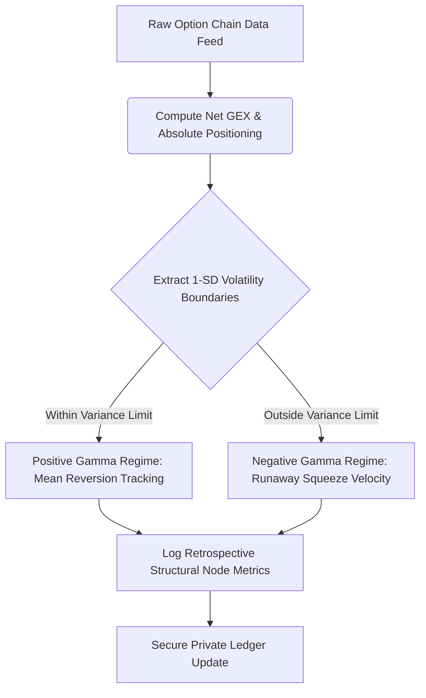

# 🔬 Independent Research Terminal: Market Microstructure & Systems Logic

Welcome to my quantitative development node. This repository functions as a public research gateway documenting independent, theoretical frameworks for systemic order book dynamics, market-maker inventory constraints, and derivative-induced liquidity distribution.

---

## 📊 Core Research Focus Areas

### 📦 Module 1: Derivative Open Interest Modeling & Term Structure Drift
* **Structural Drift Analysis:** Mapping the chronological migration of call and put open interest configurations across varying expiries.
* **Decompression Vectors:** Analyzing option matrix velocity to isolate where liquidity gaps manifest during holiday or contract roll periods.

### 🔄 Module 2: Market Maker Inventory Mechanics & Vacuum Loops
* **Short-Gamma Acceleration:** Modeling the forced, mechanical delta-hedging feedback loops that trigger localized liquidity vacuums.
* **Spread Widening Signatures:** Measuring structural order-book imbalances where counterparty liquidity collapses, causing bid/ask spreads to dynamically expand (`>3×`).

### 🧮 Module 3: Order Dynamics & Statistical Variance Boundaries
* **Expected Move Modeling:** Evaluating implied variance to establish structural daily limits.
* **Liquidity Sweep Metrics:** Documenting retrospective case studies where extended-hours stop-runs target long-dated, high-density cumulative volume blocks.

---

## 📐 Theoretical Framework & Mathematical Baselines

To map out conditional, non-directional "If/Then" pathways across global index complexes ($NDX / $MNQ), the architecture processes backward-looking market geometry through classical variance structures.

### 1. Implied Session Variance Boundary (1-SD Expected Move)
The baseline statistical boundary ($EM$) for any given session is extracted using the underlying index front-month implied volatility ($\sigma$), normalized for a single-day trading horizon:

$$EM = \text{Spot} \times \left( \sigma \times \sqrt{\frac{1}{252}} \right)$$

### 2. Market Maker Regime Shift (Structural Invalidation Node)
When price action violates the initial 1-SD boundary ($Spot > Upper\ Limit$), dealer position geometry transitions from a stabilizing positive-gamma buffer into an active, self-reinforcing negative-gamma covering cycle:

$$\text{Dealer Delta Net Flow} \propto \frac{\partial \Delta}{\partial S} = \Gamma \rightarrow \text{Accelerated Futures Accumulation}$$

---

## 🗺️ Algorithmic Workflow & Operational Pipeline

---

## 📥 Connect & Request Access

Because this terminal is a passion-driven research space, I actively look to connect with fellow systems thinkers, quantitative developers, and data engineers. To keep our network highly focused, maintain strict regulatory compliance, and preserve the academic integrity of this study space, full viewing access to the live tracking ledger is shared exclusively peer-to-peer.

### 🚀 How to Sync with the Private Archive:
1. **Professional Alignment:** Connect with my professional network on LinkedIn *(link embedded below)* so we can introduce ourselves.
2. **Context Message:** Drop a quick message outlining your professional background, your specific research interest in microstructure mechanics, and your GitHub username.
3. **Repository Grant:** Following a peer-to-peer review, I will manually configure your account credentials as a repository collaborator.

---

## ⚠️ Regulatory Notice & Compliance Statement
* **Strictly Non-Transactional:** This repository is an archive of mathematical frameworks. It does not facilitate, support, or execute live transactional trading.
* **Retrospective Analysis Only:** All analytical tracking profiles operate entirely on historical, backward-looking option chain datasets.
* **No Financial Advice:** Under no circumstances does any content within this public node or the private tracking ledger constitute financial product advice, investment recommendations, or an endorsement to trade financial instruments. The author is an independent analyst, not an AFS Licensed adviser.

---

  <b>Independent Research & Quantitative Logic • Secure Architecture • Retrospective Focus</b>

